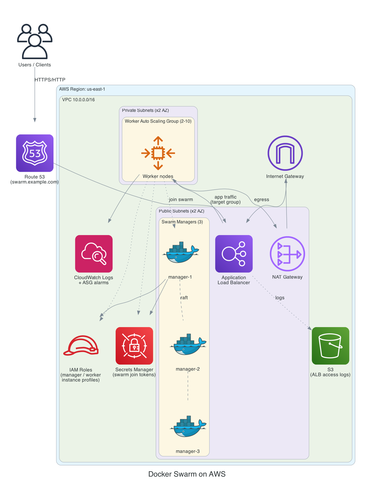

# Docker Swarm on AWS — Architecture

A production-grade, highly-available Docker Swarm cluster provisioned with Terraform on AWS. Managers run the Swarm control plane across multiple Availability Zones; workers run application workloads behind an Application Load Balancer and scale automatically.

---

## Architecture Diagram



> The diagram is generated from code with official AWS icons. To regenerate after changes:
> ```bash
> pip install diagrams        # requires graphviz on PATH (brew install graphviz)
> python3 docs/generate_diagram.py
> ```

---

## High-Level Overview

| Layer | Components | Placement |
|-------|-----------|-----------|
| Edge / DNS | Route 53 record → ALB | Public |
| Load balancing | Application Load Balancer (HTTP/HTTPS) | Public subnets |
| Control plane | 3× Swarm manager EC2 instances (raft quorum) | Public subnets |
| Data plane | Worker Auto Scaling Group (2–10 EC2) | Private subnets |
| Egress | NAT Gateway per AZ | Public subnets |
| Secrets | Secrets Manager (Swarm join tokens) | Regional |
| Identity | IAM roles + instance profiles | Regional |
| Observability | CloudWatch Logs + ASG CPU alarms | Regional |
| Audit | S3 bucket for ALB access logs | Regional |

---

## Network Topology

- **VPC** `10.0.0.0/16` with DNS support and hostnames enabled.
- **Public subnets** (one per AZ, `10.0.0.0/24`, `10.0.1.0/24`): host the ALB, NAT gateways, and Swarm managers. Routed to the **Internet Gateway**.
- **Private subnets** (one per AZ, `10.0.10.0/24`, `10.0.11.0/24`): host worker nodes. Outbound-only via the per-AZ **NAT Gateway**.
- **Route tables**: one public route table (→ IGW) shared across public subnets; one private route table per AZ (→ that AZ's NAT gateway), keeping egress traffic AZ-local.
- **Multi-AZ** by default (`az_count = 2`) for resilience.

```
                       Internet
                          │
                    Internet Gateway
                          │
   ┌──────────────── Public subnets (per AZ) ────────────────┐
   │   ALB     NAT GW     Swarm managers (raft quorum)        │
   └───────────────────────────│─────────────────────────────┘
                                │ NAT egress
   ┌──────────────── Private subnets (per AZ) ───────────────┐
   │            Worker Auto Scaling Group (app)               │
   └──────────────────────────────────────────────────────────┘
```

---

## Component Detail

### Swarm Managers (`modules/manager`)
- 3 instances (`manager_count`) to maintain an odd raft quorum (tolerates 1 failure).
- A designated **primary** initializes the swarm and publishes the worker/manager join tokens to **Secrets Manager**; secondaries join as managers.
- Bootstrap via user-data installs Docker CE and initializes/joins the swarm.
- Logs shipped to a dedicated **CloudWatch Log Group**.

### Worker Nodes (`modules/workers`)
- **Launch template** + **Auto Scaling Group** (`min_workers`/`desired_workers`/`max_workers`, default 2/3/10).
- On boot, workers read the join token from Secrets Manager and join the swarm via the manager's private IP.
- Registered to the ALB **target group**.
- **Target tracking / step scaling**: CloudWatch CPU alarms drive scale-out and scale-in policies.

### Load Balancer (`modules/load_balancer`)
- **Application Load Balancer** in the public subnets.
- HTTP listener (port 80); HTTPS listener (port 443) enabled when `certificate_arn` is provided.
- Target group health-checks workers on `health_check_path`.
- **Access logs** written to a private, lifecycle-managed S3 bucket.

### DNS (`modules/dns`)
- Optional Route 53 alias records (`domain_name`, `www.domain_name`) pointing at the ALB. Skipped when `hosted_zone_id`/`domain_name` are empty.

### IAM (`modules/iam`)
- Separate **manager** and **worker** roles + instance profiles, least-privilege scoped to read/write the Swarm token secret and write CloudWatch logs.
- **Secrets Manager** secret holds the swarm join tokens (created with a placeholder, populated at runtime by the primary manager).

### Security Groups (`modules/security`)
- **ALB SG**: ingress 80/443 from the internet.
- **Manager SG**: Swarm control ports (2377/tcp, 7946 tcp+udp, 4789/udp) from within the VPC; SSH (22) restricted to `allowed_cidr`.
- **Worker SG**: app port from the ALB SG; Swarm overlay ports from the manager/worker SGs; SSH from `allowed_cidr`.

---

## Security Posture

- Workers live in **private subnets** — no direct inbound from the internet.
- SSH ingress is restricted to `allowed_cidr`; set it to `[]` to rely solely on **SSM Session Manager**.
- Swarm join tokens are stored in **Secrets Manager**, never baked into AMIs or user-data.
- ALB access logs are retained in a **private** S3 bucket (public access blocked, lifecycle expiry).
- IAM roles are **least-privilege** and split by node role.
- Remote Terraform state is stored **encrypted in S3** with **DynamoDB locking**; CI authenticates via **GitHub OIDC** (no long-lived AWS keys). See [PIPELINE.md](PIPELINE.md).

---

## Key Inputs (`variables.tf`)

| Variable | Default | Purpose |
|----------|---------|---------|
| `aws_region` | `us-east-1` | Target region |
| `vpc_cidr` | `10.0.0.0/16` | VPC address space |
| `az_count` | `2` | Number of AZs to span |
| `manager_instance_type` | `t3.medium` | Manager size |
| `worker_instance_type` | `t3.large` | Worker size |
| `manager_count` | `3` | Manager quorum size |
| `min/desired/max_workers` | `2 / 3 / 10` | Worker ASG bounds |
| `allowed_cidr` | — | SSH allow-list (`[]` = SSM only) |
| `key_name` | — | EC2 key pair for SSH |
| `certificate_arn` | `""` | ACM cert → enables HTTPS |
| `hosted_zone_id` / `domain_name` | `""` | Enable Route 53 record |

---

## Module Map

```
.
├── main.tf                 # VPC, subnets, routing, module wiring
├── variables.tf            # root inputs
├── outputs.tf              # ALB DNS, manager IPs, etc.
├── backend.hcl             # S3 remote-state config
├── bootstrap/              # one-time: state bucket, lock table, OIDC role
└── modules/
    ├── iam/                # roles, instance profiles, secrets
    ├── security/           # security groups
    ├── manager/            # manager EC2 + log group
    ├── workers/            # launch template, ASG, scaling, alarms
    ├── load_balancer/      # ALB, target group, listeners, log bucket
    └── dns/                # Route 53 records
```
