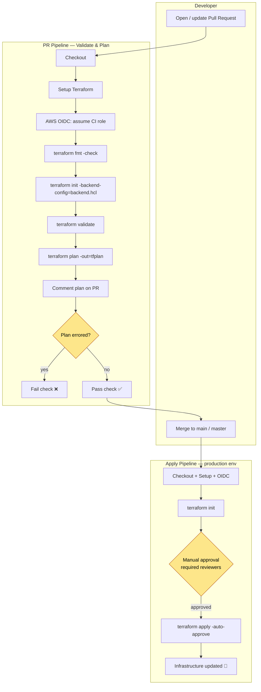
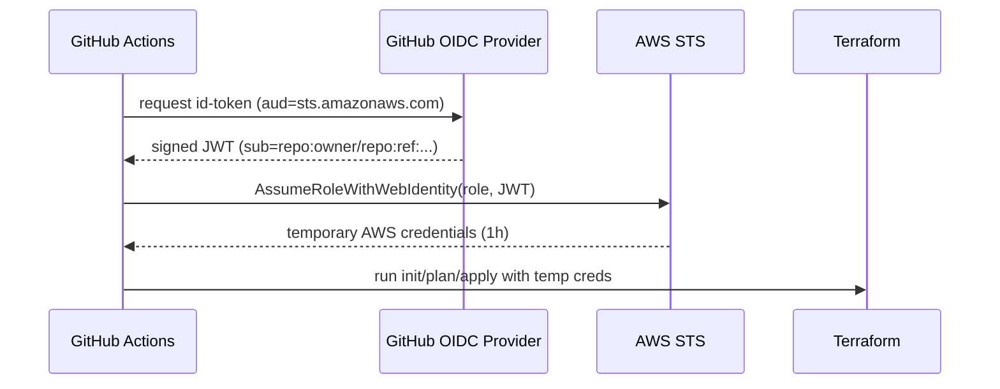
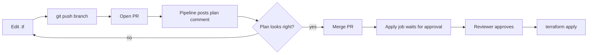

# CI/CD Pipeline — Terraform on GitHub Actions

This document describes the automated infrastructure pipeline for the Docker Swarm project: how Terraform is validated, planned, reviewed, and applied; how AWS access is brokered without long-lived secrets; and how to set it up from scratch.

Workflow file: [`.github/workflows/terraform.yml`](../.github/workflows/terraform.yml)

---

## Goals

- **Plan on every PR**, applied only after merge — no surprise infrastructure changes.
- **Keyless AWS auth** via GitHub OIDC — no static `AWS_ACCESS_KEY_ID` stored in GitHub.
- **Remote, locked state** in S3 + DynamoDB — safe concurrent runs, durable history.
- **Human gate** before production apply via a GitHub Environment with required reviewers.

---

## Pipeline Flow



---

## Triggers

| Event | Branch | Jobs run |
|-------|--------|----------|
| `pull_request` | `main`, `master` | **Validate & Plan** (posts plan as PR comment) |
| `push` | `main`, `master` | **Validate & Plan** → **Apply** (gated by `production` env) |

A `concurrency` group (`terraform-<ref>`) prevents two runs from racing on the same state; in-progress runs are **not** cancelled (so an apply is never interrupted mid-flight).

---

## Jobs & Steps

### Job 1 — `terraform` (Validate & Plan)

| Step | Command | Notes |
|------|---------|-------|
| Checkout | `actions/checkout@v4` | |
| Setup Terraform | `hashicorp/setup-terraform@v3` | Pins `TF_VERSION` (1.14.3) |
| AWS auth | `aws-actions/configure-aws-credentials@v4` | OIDC → assumes `AWS_ROLE_ARN` |
| `fmt` | `terraform fmt -check -recursive` | Non-blocking (`continue-on-error`) |
| `init` | `terraform init -backend-config=backend.hcl` | Connects to S3 backend |
| `validate` | `terraform validate` | Syntax / type checks |
| `plan` | `terraform plan -out=tfplan` | PR only; output captured |
| Comment | `actions/github-script@v7` | Posts fmt/init/validate/plan status + collapsible plan |
| Gate | `exit 1` if plan failed | Turns the PR check red |

### Job 2 — `apply`

- `needs: terraform` (only runs if validation passed).
- Guard: `github.event_name == 'push'` **and** ref is `main`/`master` — never runs on PRs.
- `environment: production` — attaches the GitHub Environment so **required reviewers** must approve before `terraform apply -auto-approve` executes.

---

## Authentication — GitHub OIDC (keyless)

Instead of storing AWS access keys, GitHub Actions presents a short-lived OIDC token that AWS STS exchanges for temporary credentials by assuming an IAM role.



The trust policy (created in `bootstrap/`) restricts which repo and refs may assume the role:

- `aud` must equal `sts.amazonaws.com`
- `sub` must match `repo:<owner/repo>:ref:refs/heads/main`, `…/master`, or `…:pull_request`

Workflow permissions required:
```yaml
permissions:
  id-token: write     # mint the OIDC token
  contents: read
  pull-requests: write
```

---

## Remote State

State lives in S3 with DynamoDB locking, configured as a **partial backend** so values aren't hardcoded in source:

- `main.tf`:
  ```hcl
  backend "s3" {
    key     = "docker-swarm/terraform.tfstate"
    encrypt = true
  }
  ```
- `backend.hcl` (supplied via `-backend-config`):
  ```hcl
  bucket         = "docker-swarm-tfstate-<account-id>"
  region         = "us-east-1"
  dynamodb_table = "terraform-locks"
  ```

Benefits: durable encrypted state, version history, and a lock that blocks concurrent `apply`s.

---

## One-Time Setup

The state bucket, lock table, and OIDC role must exist **before** the pipeline can run. They are provisioned by the `bootstrap/` config (which uses local state).

### 1. Run bootstrap (admin credentials, once)
```bash
cd bootstrap
cp terraform.tfvars.example terraform.tfvars
#   set state_bucket_name (globally unique) and github_repo (owner/repo)
terraform init
terraform apply
```

Outputs:
| Output | Use |
|--------|-----|
| `state_bucket_name` | put in `backend.hcl` |
| `lock_table_name` | put in `backend.hcl` |
| `ci_role_arn` | GitHub secret `AWS_ROLE_ARN` |

### 2. Configure GitHub repo
- **Secret** → `AWS_ROLE_ARN` = the `ci_role_arn` output.
- **Settings → Environments** → create `production`; add required reviewers to gate apply.
- Ensure `github_repo` in bootstrap matches the real `owner/repo`.

### 3. Application variables
The plan/apply need values that have no defaults (e.g. `key_name`). Provide them via either:
- a committed `*.auto.tfvars` with **non-secret** values, or
- repo **variables** referenced as `TF_VAR_*` env in the workflow.

> Local `terraform.tfvars` is git-ignored and **not** available in CI by design.

---

## Day-to-Day Flow



1. Branch, edit Terraform, push, open a PR.
2. Read the **plan comment** the bot posts on the PR.
3. Merge once the plan is correct and the check is green.
4. Approve the **production** environment when prompted; apply runs automatically.

---

## Hardening / Next Steps

- **Scope the CI IAM role down** from `PowerUserAccess` + `iam:*` to only the services this stack uses (EC2, ELB, autoscaling, Route 53, Secrets Manager, CloudWatch, S3).
- Add **policy-as-code** checks (`tfsec`, `checkov`, or `terraform-compliance`) as PR steps.
- Add `terraform plan -detailed-exitcode` to flag drift on a schedule.
- Pin module/provider versions and enable **Dependabot** for the Actions.
- Consider per-environment workspaces or separate state keys for `dev`/`prod`.
```
